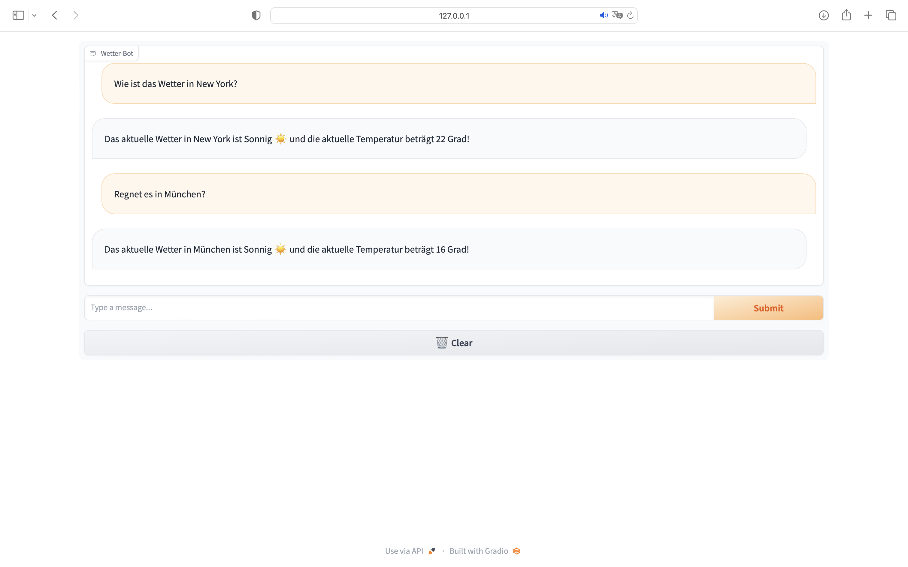

# Weather-Bot

The Weather-Bot is ready to answer your questions about the weather in a city of your choice.
All you have to do is indicate a weather-related keyword and provide the name of the city you're interested in within
your request.



## Requirements

To be able to use the program on your local system, certain prerequisites are required:

* You must have Python installed on your computer in version 3.8 or higher.


* The Python library Gradio must also be installed. You can do this with the following command:
     ````
  pip install gradio
     ````


* Similarly, the Python library python-weather is required and can be installed with this command:
    ````
  pip install python-weather
    ````
