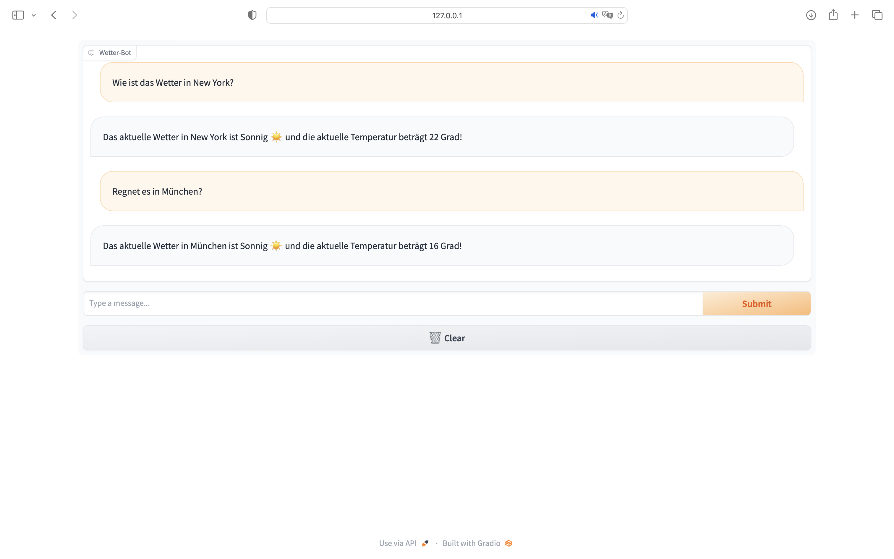
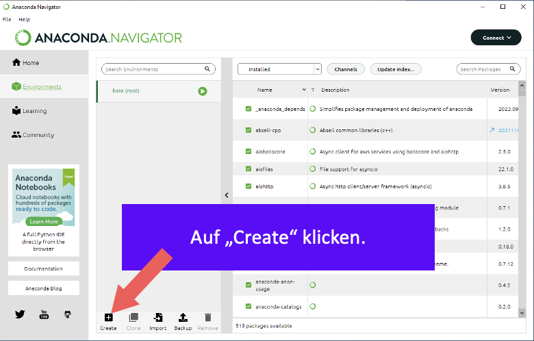
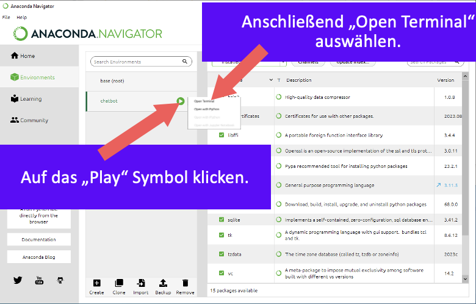

# Weather-Bot

The Weather-Bot is ready to answer your questions about the weather in a city of your choice.
All you have to do is indicate a weather-related keyword and provide the name of the city you're interested in within
your request.



## Requirements

To be able to use the program on your local system, certain prerequisites are required. For a smoother setup of all the prerequisites, it's advisable to create a new environment in Anaconda. To achieve this, the following steps need to be executed in Anaconda:

1. Open Anaconda and create a new environment
  

2. Choose Python version 3.11 and "chatbot" as environment name
  

3. Open the created environment in a terminal
  

The following libraries need to be installed, and the commands must be executed in the opened terminal:

* The Python library Gradio must also be installed. You can do this with the following command:
     ````
  pip install gradio
     ````


* Similarly, the Python library python-weather is required and can be installed with this command:
    ````
  pip install python-weather
    ````
